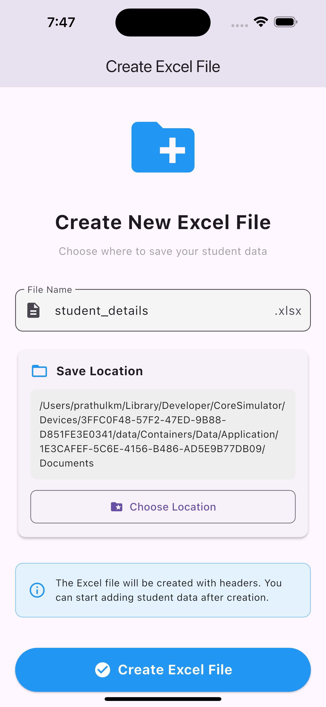
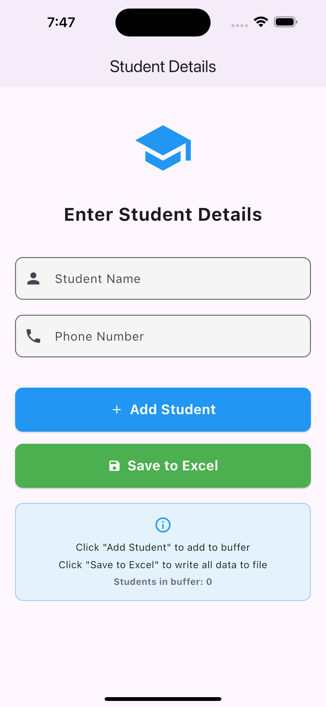

# 🗂️ Excel Data Entry Application (Flutter)

[](https://flutter.dev/) 
[](https://flutter.dev/docs/get-started/install) 
[](LICENSE)
[](https://github.com/Pr4thC0des/excel-data-entry-flutter/stargazers)

---

## 🚀 Project Overview

The **Excel Data Entry Application** is a **cross-platform Flutter app** that allows users to **create, manage, and update Excel (`.xlsx`) files** directly from a sleek interface. Users can **choose the file location**, **enter data via interactive forms**, and **save automatically**, eliminating the need for Excel software.  

Ideal for **attendance tracking, inventories, student records, and expenses**, it offers a **portable, offline, and efficient solution** for structured data management.

<details>
<summary>🎯 Key Features</summary>

- ✅ Create Excel sheets in any location  
- ✅ Add, update, and save data through the app  
- ✅ Offline functionality – no internet needed  
- ✅ Cross-platform support – Android, Windows, macOS  
- ✅ Automatic file detection and editing  
- ✅ Clean and intuitive UI for data entry  

</details>

---

## 📸 Screenshots & Demo

**1️⃣ App Home / File Creation**  
  

**2️⃣ Data Entry Interface**  
  

**3️⃣ App Demo GIF**  
  

---

## 🛠️ Built With

- [Flutter](https://flutter.dev/) – Cross-platform framework  
- [Dart](https://dart.dev/) – Programming language  
- [excel](https://pub.dev/packages/excel) / [syncfusion_flutter_xlsio](https://pub.dev/packages/syncfusion_flutter_xlsio) – Excel file handling  

---

## ⚡ Getting Started

<details>
<summary>Click to expand instructions</summary>

### Prerequisites
- Flutter SDK  
- Dart  
- IDE (VS Code, Android Studio)

### Installation
```bash
git clone https://github.com/yourusername/excel-data-entry-flutter.git
cd excel-data-entry-flutter
flutter pub get
flutter run
